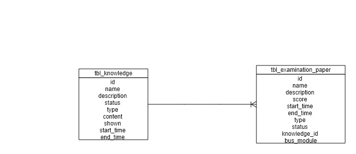
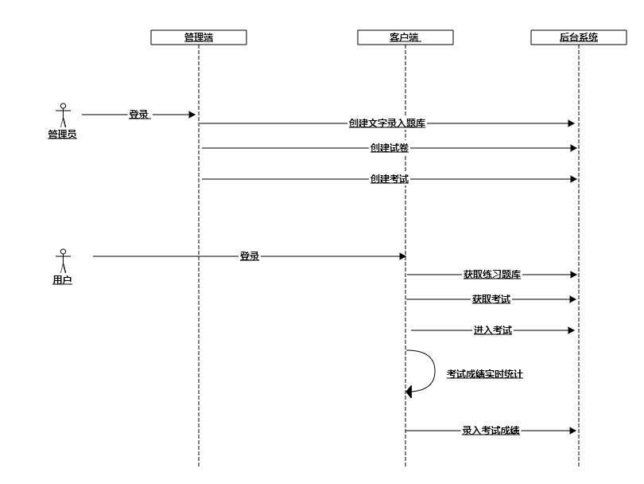

<!-- MarkdownTOC autolink="true" bracket="round" uri_encoding="false" autoanchor="true"-->

- 文字录入需求文档
    - 概述
    - 文档目的
    - 管理端设计
    - 客户端设计
    - 风险评估

<!-- /MarkdownTOC -->

# 考试中心需求文档
## 概述
 文字录入的目的是为了提高用户在电脑端打字的速度，帮助客户端对培养用户打字速度进行有效的管理。主要包括用户端和管理端。
 用户端：用户可以选择系统提供的练习模版进行练习和考试，练习过程中会时时显示用户正确率，结束会统计用户总数入量，错误数量，错误率，总速度和有效速度。用户也可以看到历次考试的详情信息
 客户端：题库管理，管理员可以上传文字文件创建题库。试卷管理可以创建，编辑，删除，查看试卷。考试管理可以有关考试的详细信息
## 文档目的
 需求人员将开发内容和实现的功能进行描述，开发人员根据文档能清晰直观的了解本次开发的目的和开发内容
## 管理端设计
拥有后台管理权限的管理员，登录控制台，能够在控制台考试管理模块的题库管理面板新增文字录入题库， 管理员可以填写题库名称，是否启用题库，选择题库类型为文字录入，上传题库模版，是否显示题库文本等等。鉴于客户端分为练习模式和考试模式，管理员可新增类型为练习模式和考试模式的文字录入题库；练习模式的文字录入题库，仅在客户端的学习中心的文字录入模块展示，且练习提交后不会影响考试计算成绩；考试模式的文字录入题库，管理员在创建文字录入类型考试时，可选择关联文字录入题库，在客户端考试中心，选择后台创建的文字录入考试，开始考试后将展示后台创建的文字录入考试内容。
### 数据存储E-R图设计

#### 考试题库模块设计
|字段|类型|描述|示例
|---|---|---|---
|id|bigint|题库唯一标识| 100
|name|varchar(32)|题库名称|文字练习
|description|varchar(255)|题库描述|练习打字
|start_time|datetime|题库开始时间|2020-01-01 12:40:00
|end_time|datetime|题库结束时间|2020-06-01 12:40:00
|status|varchar(16)|题库状态|Enable
|type|varcahr(16)|题库类型|文字录入
|content|varchar(1000)|题库文本|银行福利真是好
|shown|bit(1)|文本是否展示|true
#### 考试模块设计更新
|字段|类型|描述|示例
|---|---|---|---
|id|bigint|试卷唯一标识| 100
|name|varchar(32)|试卷名称|文字练习考试
|description|varchar(255)|试卷描述|文字练习综合应用考试
|start_time|datetime|试卷开始时间|2020-01-01 12:40:00
|end_time|datetime|试卷结束时间|2020-06-01 12:40:00
|status|varchar(16)|试卷状态|Enable
|type|varcahr(16)|试卷类型|文字录入
|bus_module|varchar(100)|业务模块|
|knowledge_id|bigint|关联题库|100
### 流程图设计

## 客户端设计
学习中心新增文字录入模块  
考试中心新增文字录入考试查询，文字考试测评，文字考试成绩录入